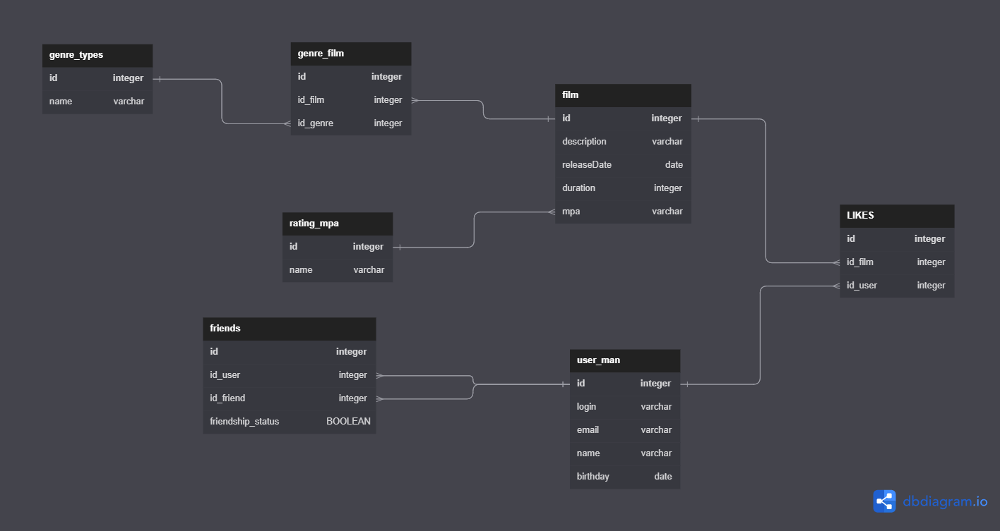

# java-filmorate
Template repository for Filmorate project.



Examples:

1. find likes:

```
SELECT likes.user.id
FROM film 
LEFT OUTER JOIN likes ON film.id=likes.film_id
```

2. find user(id=1) friends 

```
SELECT friend.id_friends
FROM user
LEFT OUTER JOIN friends ON user.id=friends.id_user
WHERE friends.id_user = 1 
```

3. find film(id=1) genre

```
SELECT genre.name
FROM film
LEFT OUTER JOIN genre_film ON film.id=genre_film.id_film
LEFT OUTER JOIN genre ON genre_film.id_genre=genre.id
```
